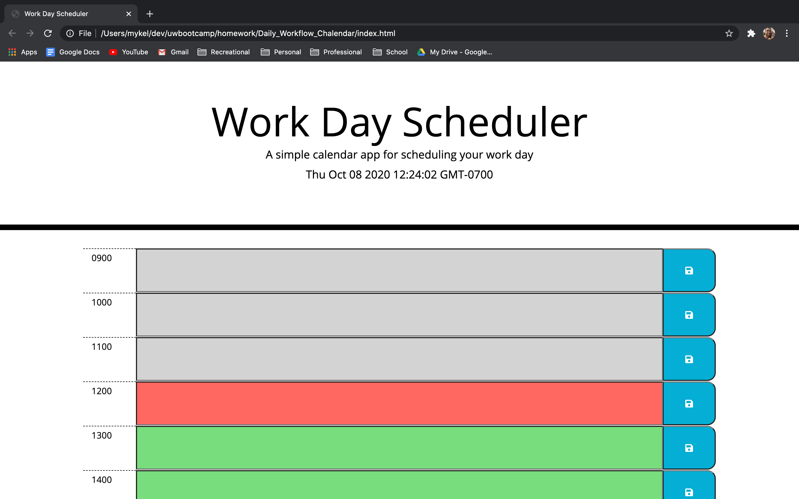
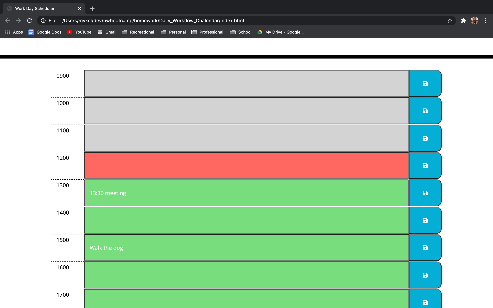

# Daily_Workflow_Calendar

Stay on track every day with this daily planner that updates dynamically as the work day goes on.

-----

## Links

here is a link to the launched application [link](https://valadezmykel.github.io/Daily_Workflow_Chalendar/)

here is a link to the code repository [link](https://github.com/valadezMykel/Daily_Workflow_Chalendar)

-----

## About

When the application is opened in a browser you will be shown a screen with rows to contain your tasks for each hour.  Grey is for tasks that should already be done, red for current tasks, and green for one to be done later.

Simply type directly into the text area in the middle of each row adn when you are ready click the blue save button on the right of the row.

-----

## Usage

To this application you will need to use a web browser.

-----

## API

API used in this project are:

jQuery

Moment js

-----

## Installation

Click [here](https://valadezmykel.github.io/Daily_Workflow_Chalendar/) to use the cite without installing 

Click [here](https://github.com/valadezMykel/Daily_Workflow_Chalendar) to go to the github repo

-----

## License

No license applied